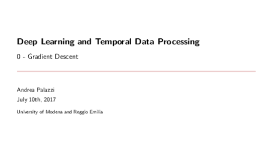
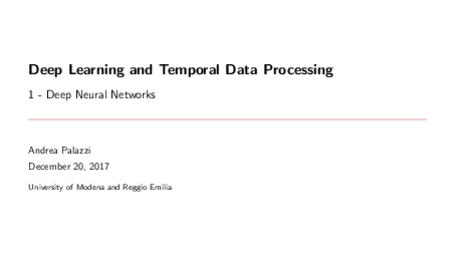
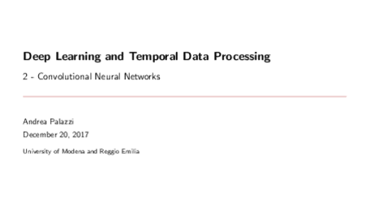
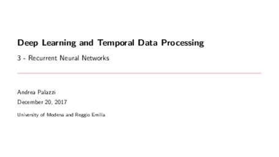

# machine_learning_lectures

**Collection of lectures and lab lectures on machine learning and deep learning.**

---

## Deep Learning

### Gradient Descent

 
LaTeX source: [here](https://github.com/ndrplz/machine_learning_lectures/tree/master/slides/deep_learning/gradient_descent).

### Neural Networks and Deep Neural Networks

 
LaTeX source: [here](https://github.com/ndrplz/machine_learning_lectures/blob/master/slides/deep_learning/deep_neural_networks/).

### Convolutional Neural Netowrks

 
LaTeX source: [here](https://github.com/ndrplz/machine_learning_lectures/tree/master/slides/deep_learning/convolutional_neural_networks).

### Recurrent Neural Netowrks

 
LaTeX source: [here](https://github.com/ndrplz/machine_learning_lectures/tree/master/slides/deep_learning/recurrent_neural_networks).

## Reinforcement Learning
- **[Introduction and Model Free Learning](https://github.com/ndrplz/machine_learning_lectures/blob/master/slides/reinforcement_learning/01_introduction_and_model_free_learning/01_introduction_and_model_free_learning.pdf)** - Introduction to reinforcement learning and model free learning.
- **[Function Approximation](https://github.com/ndrplz/machine_learning_lectures/blob/master/slides/reinforcement_learning/02_function_approximation/02_function_approximation.pdf)** - Overview of function approximation methods

## Machine Learning

## PRACTICE
- **[Boosting](https://github.com/ndrplz/machine_learning_lectures/tree/master/lab/boosting)**
- **[Clustering](https://github.com/ndrplz/machine_learning_lectures/tree/master/lab/clustering)**
- **[Dimensionality Reduction](https://github.com/ndrplz/machine_learning_lectures/tree/master/lab/dimensionality_reduction)**
- **[Logistic Regression](https://github.com/ndrplz/machine_learning_lectures/tree/master/lab/logistic_regression)**
- **[Naive Bayes](https://github.com/ndrplz/machine_learning_lectures/tree/master/lab/naive_bayes)**
- **[Q Learning](https://github.com/ndrplz/machine_learning_lectures/tree/master/lab/q_learning)**
- **[Support Vector Machine](https://github.com/ndrplz/machine_learning_lectures/tree/master/lab/support_vector_machines)**
- **[Introduction to TensorFlow](https://github.com/ndrplz/machine_learning_lectures/tree/master/lab/tensorflow_introduction/)**
- **[Linear Regression (TensorFlow)](https://github.com/ndrplz/machine_learning_lectures/tree/master/lab/tensorflow_linear_regression)**
- **[Neural Networks (TensorFlow)](https://github.com/ndrplz/machine_learning_lectures/tree/master/lab/tensorflow_neural_network)**
- **[Convolutional Networks (TensorFlow)](https://github.com/ndrplz/machine_learning_lectures/tree/master/lab/tensorflow_convolutional_nets)**
- **[Recurrent Networks (TensorFlow)](https://github.com/ndrplz/machine_learning_lectures/tree/master/lab/tensorflow_recurrent_nets)**
 
## F.A.Q.

* **How did you make the thumbnails?** 

Please see [`make_thumbs.py`](./make_thumbs.py). The script assumes that [ImageMagick](https://imagemagick.org/index.php) library is already installed in your system.
