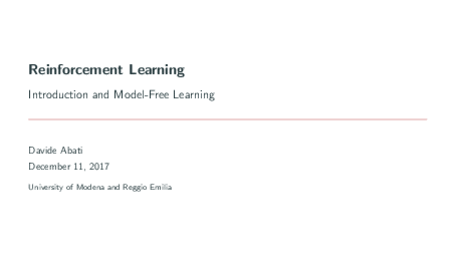
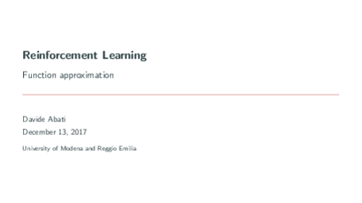
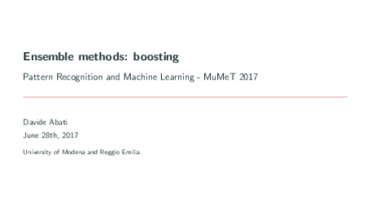
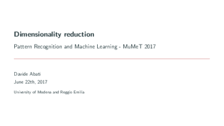
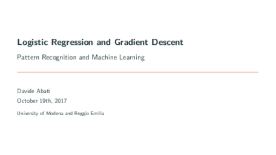
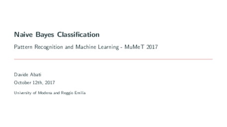
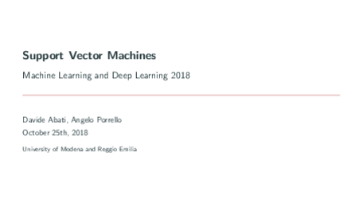

# machine_learning_lectures

**Collection of lectures and lab lectures on machine learning and deep learning.**

---

## Deep Learning

### Gradient Descent

 
LaTeX source: [here](https://github.com/ndrplz/machine_learning_lectures/tree/master/slides/deep_learning/gradient_descent).

### Neural Networks and Deep Neural Networks

 
LaTeX source: [here](https://github.com/ndrplz/machine_learning_lectures/blob/master/slides/deep_learning/deep_neural_networks/).

### Convolutional Neural Netowrks

 
LaTeX source: [here](https://github.com/ndrplz/machine_learning_lectures/tree/master/slides/deep_learning/convolutional_neural_networks).

### Recurrent Neural Netowrks

 
LaTeX source: [here](https://github.com/ndrplz/machine_learning_lectures/tree/master/slides/deep_learning/recurrent_neural_networks).

---

## Reinforcement Learning

### Introduction and Model Free Learning

 
LaTeX source: [here](https://github.com/ndrplz/machine_learning_lectures/blob/master/slides/reinforcement_learning/01_introduction_and_model_free_learning/).

### Function Approximation

 
LaTeX source: [here](https://github.com/ndrplz/machine_learning_lectures/blob/master/slides/reinforcement_learning/02_function_approximation/).

---

## Machine Learning

### Boosting

 
LaTeX source: [here](https://github.com/ndrplz/machine_learning_lectures/tree/master/lab/boosting/tex).
 
Practice code: [here](https://github.com/ndrplz/machine_learning_lectures/tree/master/lab/boosting/code).

### Clustering

 
LaTeX source: [here](https://github.com/ndrplz/machine_learning_lectures/tree/master/lab/clustering/tex).
 
Practice code: [here](https://github.com/ndrplz/machine_learning_lectures/tree/master/lab/clustering/code).

### Dimensionality Reduction

 
LaTeX source: [here](https://github.com/ndrplz/machine_learning_lectures/tree/master/lab/dimensionality_reduction/tex).
 
Practice code: [here](https://github.com/ndrplz/machine_learning_lectures/tree/master/lab/dimensionality_reduction/code).

### Logistic Regression

 
LaTeX source: [here](https://github.com/ndrplz/machine_learning_lectures/tree/master/lab/logistic_regression/tex).
 
Practice code: [here](https://github.com/ndrplz/machine_learning_lectures/tree/master/lab/logistic_regression/code).

### Naive Bayes

 
LaTeX source: [here](https://github.com/ndrplz/machine_learning_lectures/tree/master/lab/naive_bayes/tex).
 
Practice code: [here](https://github.com/ndrplz/machine_learning_lectures/tree/master/lab/naive_bayes/code).

### Support Vector Machine (SVM)

 
LaTeX source: [here](https://github.com/ndrplz/machine_learning_lectures/tree/master/lab/support_vector_machines/tex).
 
Practice code: [here](https://github.com/ndrplz/machine_learning_lectures/tree/master/lab/support_vector_machines/code).

- **[Q Learning](https://github.com/ndrplz/machine_learning_lectures/tree/master/lab/q_learning)**
- **[Introduction to TensorFlow](https://github.com/ndrplz/machine_learning_lectures/tree/master/lab/tensorflow_introduction/)**
- **[Linear Regression (TensorFlow)](https://github.com/ndrplz/machine_learning_lectures/tree/master/lab/tensorflow_linear_regression)**
- **[Neural Networks (TensorFlow)](https://github.com/ndrplz/machine_learning_lectures/tree/master/lab/tensorflow_neural_network)**
- **[Convolutional Networks (TensorFlow)](https://github.com/ndrplz/machine_learning_lectures/tree/master/lab/tensorflow_convolutional_nets)**
- **[Recurrent Networks (TensorFlow)](https://github.com/ndrplz/machine_learning_lectures/tree/master/lab/tensorflow_recurrent_nets)**
 
## F.A.Q.

* **How did you make the thumbnails?** 

Please see [`make_thumbs.py`](./make_thumbs.py). The script assumes that [ImageMagick](https://imagemagick.org/index.php) library is already installed in your system.
